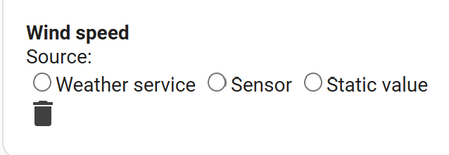

# Sensor group configuration

> Main page: [Configuration](configuration.md)<br/>
> Previous: [Module configuration](configuration-modules.md)<br/>
> Next: [Usage](usage.md)

Sensor groups define what sources provide the weather data to be collected and calculated on to determine irrigation duration. You can use any numeric Home Assistant sensor, regardless of its source. Additionally, if you [configured a weather service](installation-weatherservice.md) in this integration, you can retrieve the data from that as well.

## Adding a sensor group
Enter a sensor group name and select `Add sensor groups`. Your sensor group is added and you 'wire up' the sensors.

## Configuring a sensor group
Apart from changing the name, you can specify the source where to retrieve the weather data metrics. Metrics can be retrieved from a weather service (assuming you set it up), a sensor or a static value. When using a sensor or static value as a source, take care to make sure the unit the integration expects is the same as your sensor provides. You can choose which aggregation to use like average, maximum, minimum etc.

It's recommended to use actual sensor sources as much as you can and only rely on weather services as needed. If your zone is covered (such as a green house), of course you can set the total precipitation to 0.

The following data can be provided:

| Data | Required | Available sources | Available units | Excepted aggregation |
|---|---|---|---|--|
|**Dewpoint**|Yes|Weather Service<br/>Sensor<br/>Static value|°C<br/>°F|Average|
|**Evapotranspiration**|No|None (module will calculate it)<br/>Sensor<br/>Static value|in<br/>mm|Average|
|**Humidity**|Yes|Weather Service<br/>Sensor<br/>Static value|%|Average|
|**Total precipitation**|Yes|Weather Service<br/>Sensor<br/>Static value|in<br/>mm|Maximum or Last|
|**Pressure** (*see notes below the table)|Yes|Weather Service<br/>Sensor<br/>Static value|hPa<br/>inch Hg<br/>millibar<br/>psi|Average|
|**Solar Radiation**|No|None (requires module to estimate it)<br/>Sensor<br/>Static value|MJ/day/m2<br/>MJ/day/sq ft<br/>W/m2<br/>W/sq ft|Average|
|**Temperature**|Yes|Weather Service<br/>Sensor<br/>Static value|°C<br/>°F|Average|
|**Wind speed**|Yes|Weather Service<br/>Sensor<br/>Static value|meter/s<br/>mile/h<br/>km/h|Average|
|**Current precipitation**|No|Weather Service<br/>Sensor<br/>Static value|in/h<br/>mm/h|Last|

Please note:
- If you use a [weather service](installation-weatherservice.md), make sure your home zone coordinates are set correctly so the data is correct. This is especially true if you set the coordinates manually in the configuration.yaml.
- Pressure can either be absolute or relative pressure: _absolute barometric pressure_ is the actual pressure measured at your location, while _relative barometric pressure_ is the pressure calculated at sea level. Check the source of your data to find out whether it provides absolute or relative pressure.
- Humidity for your sensor group is the air humidity / atmospheric humidity, _not_ soil humidity. Soil Humidity sensors do not provide useful information for this integration and cannot be used.
- Wind speed needs to be measured at 2 meters height. If you are using Open Weather Map this is automatically done for you, but if you do not, you need to make sure the input sensor returns the wind speed at the correct height. You can use a template sensor like the following for this:
   ```yaml
   sensor:
     - platform: template
       sensors:
         wind_at_2m:
           friendly_name: Wind Speed at 2m
           value_template: "{{states('[name of your wind speed sensor (WSmeasured)]')|float()*(4.87/log((67.8*[height the wind speed was measured on in meters (H)])-5.42))}}"
   ```
- Total precipitation is the total amount of precipitation you want to take into account for the calculations. If you calculate once per day, close to midnight use a source that provides the total precipitation for the day. Often this is called 'daily precipitation'. If you calculate less or more often adjust accordingly. Keep in mind that the total precipitation is expected to be a total over the time period, not the current precipitation.
- Current preciptation is currently not in use, but is likely going to be used for continuous updates in the future. Note that is expected to be in in/h or mm/h, so you might need to do some basic math if you have in/m or mm/m.

## Deleting a sensor group


Use the button at the bottom to delete a sensor group. Note you can only delete sensor groups that are not used by any [zones](configuration-zones.md).


Now you are ready to [use the integration](usage.md)!
> Main page: [Configuration](configuration.md)<br/>
> Previous: [Module configuration](configuration-modules.md)<br>
> Next: [Usage](usage.md)