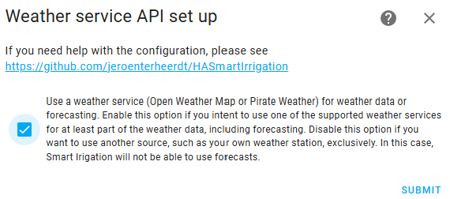
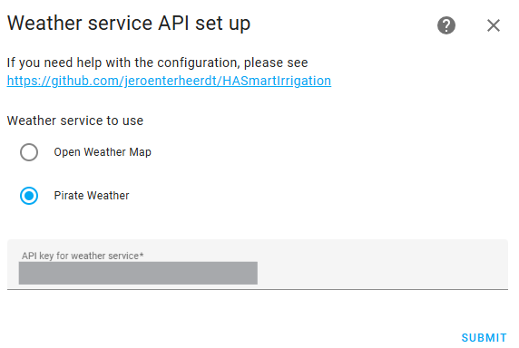

# Installation: Configuring weather service

> Main page: [Installation](installation.md) 
> Previous: [Downloading the integration](installation-download.md) 
> Next: [Configuration](configuration.md) or [Changing your settings for weather service](installation-options.md)

The installation wizard allows you to determine if you want to use a weather service and if so, which one. If you decide to use a weather service, it will also ask you for the API key. See below for instructions on how to get an API key for Open Weather Map or Pirate Weather.

Let's walk through the wizard: 
1. The first page here allows you to disable or enable the use of a weather service. If you disable this option and click `Submit` you will not be able to use forecasting in your [calculation modules](configuration-modules.md). If you enable this and click `Submit`, the next screen will allow you to set up the weather service you want to use. If you use a weather service, make sure your Home Assistant home zone coordinates are set correctly so the data is correct. This is especially true if you set the coordinates manually in the configuration.yaml. Although we recommend using a weather service by providing an free API key, you _can_ skip it. Skipping it, however, disables any ability to forecast. If it is disabled you need to use another source, such as your own weather station, exclusively. If you turn it off, you will not be able to use forecasts. If you intent to use a weather service for at least part of the weather data, including forecasting, leave this option on.

5. On this page, select the [weather service you want to use (Open Weather Map, Pirate Weather, or KNMI)](installation-weatherservice.md) and enter the API key for the weather service (see below on how to get an API key).

6. If the API key is correct you will see a success message. If you get an error you need to double check you have the right API key. Especially for Open Weather Map it can take a long time for an API key to become active.

After the integration has been installed, you will find a new panel named 'Smart Irrigation' in your side bar. [Use it to configure your set up](configuration.md).

You have now finished the installation of Smart Irrigation and are ready to continue to [Configuration](configuration.md)!

## Getting Open Weather Map API Key

Go to [OpenWeatherMap](https://openweathermap.org) and create an account. You can enter any company and purpose while creating an account. After creating your account, You will need to sign up for the paid (but free for limited API calls) OneCall API 3.0 plan if you do not have a key already. Make sure to enter credit card information to get the API truly activated. Then, go to API Keys and get your key. If the key does not work right away, no worries. The email you should have received from OpenWeaterMap says it will be activated 'within the next couple of hours'. So if it does not work right away, be patient a bit. If you are worried about the cost of the API, You can put a rate limit below the paid threshold in the "Billing plans" page of your profile. If you are currently using API 2.5, move to 3.0 ASAP as API 2.5 is going to be closed in June 2024.

## Getting Pirate Weather API key
Follow the instructions on this page (see `API Key` section): https://docs.pirateweather.net/en/latest/API/.

## Getting KNMI Data Platform API key

Go to [KNMI Data Platform](https://dataplatform.knmi.nl) and create an account. Once logged in, go to API Management and generate a new API key. The KNMI Data Platform provides free access to Dutch weather data including current observations and HARMONIE-AROME forecast model data. This service is particularly useful for users in the Netherlands and surrounding areas.

> Main page: [Installation](installation.md) 
> Previous: [Downloading the integration](installation-download.md) 
> Next: [Configuration](configuration.md) or [Changing your settings for weather service](installation-options.md)
